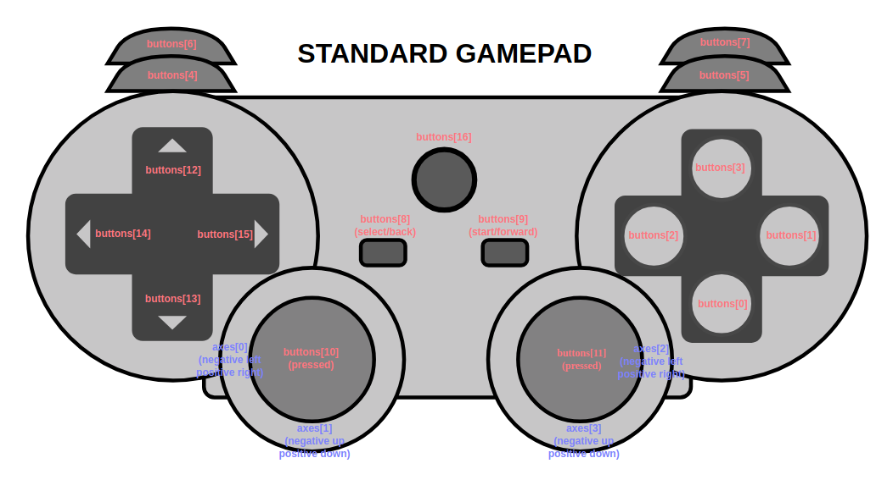

# HTML5 Gamepad API Enhancements #
[](LICENSE)

Gamepads.js is a JavaScript module for tracking Gamepads and events pertaining to their usage. Gamepads.js also offers an optional gamepad mapping extension containing button images.

## Why use this library instead of the built-in Gamepad API?

The [existing Gamepad standard](https://developer.mozilla.org/en-US/docs/Web/API/Gamepad_API/Using_the_Gamepad_API) lacks support for button/joystick events, and `gamepadconnected`/`gamepaddisconnected` events do not work consistently across browsers. This module seeks to offer a standard event-handling implementation that works across multiple browsers.

## Installation

Include the script hosted on jsDelivr CDN.

```html
<script src='https://cdn.jsdelivr.net/gh/FThompson/gamepads.js@latest/gamepads.min.js'></script>
```

Or [download the script](https://github.com/FThompson/Gamepads.js/blob/master/gamepads.js) and include it on your page.

```html
<script src='gamepads.js'></script>
```

## Usage

The `gamepads.js` script exposes the `gamepads` object that takes care of event polling and tracking which gamepads are currently connected. You can add event handlers to this object to track when a gamepad is connected or disconnected.

```javascript
gamepads.addEventListener('connect', e => {
    console.log('Gamepad connected');
    console.log(e.gamepad);
});

gamepads.addEventListener('disconnect', e => {
    console.log('Gamepad disconnected');
    console.log(e.gamepad);
});
```

These examples print the gamepad instances related to each connect or disconnect event. You can add event handlers to these gamepad objects to track gamepad events:
* `buttonpress` fires when a button is pressed and passes the button `index` to event handlers.
* `buttonrelease` fires when a button is released and passes the button `index` to event handlers.
* `buttonvaluechange` fires when a button value changes and passes the button `index` and `value` to event handlers. This value will typically be `0` or `1` except in the case of an axis button like a trigger, which can have a value between `0` and `1`.
* `axischange` fires when a gamepad axis changes and passes the axis `index` and `value` to event handlers.
* `joystickmove` fires when a joystick moves and passes the axes `indices` and `values` to event handlers each as two-item arrays. To use this event, you must pass a two-length array of axis indices to the third parameter of `addEventListener` corresponding to the horizontal and vertical axis indices. Joystick axis values go from `-1` (left/top) to `1` (right/bottom). This library applies a `0.10` deadzone by default, and this value is subtracted from the absolute minimum and maximum joystick axis values to smooth out values in the deadzone.

```javascript
gamepads.addEventListener('connect', e => {
    console.log('Gamepad connected');
    console.log(e.gamepad);
    e.gamepad.addEventListener('buttonpress', e => console.log(e));
    e.gamepad.addEventListener('buttonrelease', e => console.log(e));
    e.gamepad.addEventListener('joystickmove', e => console.log(e), [0, 1]);
});
```

In this example, the `[0, 1]` parameter in the `joystickmove` event handler corresponds to the axis indices of the left joystick on the standard gamepad mapping.


<p align='center'><sub><sup>The standard gamepad mapping showing buttons and axes to indices. Diagram courtesy of <a href='http://www.w3.org/TR/gamepad/' title='W3C Gamepad Specification'>W3C.org</a></sup></sub></p>

You can query a gamepad to determine if it follows the standard gamepad mapping using `gamepad.mapping`. This value will either be `"standard"` or `""`.

The `gamepads.js` script includes an object containing the standard gamepad mapping, `StandardMapping`, with indices split up into `Button` and `Axis` objects. You can use these index values in gamepad event handlers to identify which buttons the user is interacting with.

```javascript
const xboxYIndex = StandardMapping.Button.BUTTON_TOP; // 3
const dpadUpIndex = StandardMapping.Button.D_PAD_UP; // 12
const leftStickIndices = StandardMapping.Axis.JOYSTICK_LEFT; // [0, 1]
```

Notice that the standard mapping object contains joystick index pairs you can use to specify which joystick you want to add an event handler to.

```javascript
e.gamepad.addEventListener('joystickmove', e => console.log(e), StandardMapping.Axis.JOYSTICK_LEFT);
```

### GamepadMappings.js Extension

This library contains an extension, `gamepad-mappings.js`, which maps gamepad indices to button image icons. This extension is shipped separately from the core `gamepads.js` due to its size. You can download `gamepad-mappings.js.zip` in the Releases tab [here](https://github.com/FThompson/Gamepads.js/releases). This ZIP archive contains the `gamepad-mappings.js` script and a folder containing the button images.

The `gamepad-mappings.js` file is also available on jsDelivr CDN.

```html
<script src='https://cdn.jsdelivr.net/gh/FThompson/gamepads.js@latest/gamepad-mappings.min.js'></script>
```

Or you can link the downloaded script.

```html
<script src='gamepad-mappings.js'></script>
```

The `gamepad-mappings.js` script exposes the `gamepadMappings` object that you can use to translate gamepad indices to button names and images through the `gamepadMappings.getButton` function.

```javascript
gamepads.addEventListener('connect', e => {
    console.log('Gamepad connected');
    console.log(e.gamepad);
    e.gamepad.addEventListener('buttonpress', e => {
        let button = gamepadMappings.getButton('Xbox One', e.index);
        console.log(button);
    });
});
```

You must specify one of the following supported mapping names as the first parameter to `getButton`:
* `"Xbox One"`
* `"Xbox 360"`
* `"PS4"`
* `"PS3"`

The `gamepadMappings.getButton` function returns an object containing `mappingName`, `buttonName` (such as `"Y"`), and `buttonImageSrc`, which is the URL for the button's image starting with the default path `/buttons`. You can change the root path of `buttonImageSrc` by setting `gamepadMappings.buttonsPath`.

You can place the button images in any directory you like, or use jsDelivr CDN for accessing button images:

```javascript
gamepadMappings.buttonsPath = 'https://cdn.jsdelivr.net/gh/FThompson/gamepads.js@latest/buttons';
```

#### Detecting Gamepad Model

Gamepad objects contain an `id` property that can offer clues to what brand of gamepad is connected, but you cannot rely on this value because some drivers map gamepads to Xbox 360 layouts for compatibility. Instead, you should give users the option to choose which mapping to display and use their selected mapping in `gamepadMapping.getButton` calls throughout your application.

## Live Example

You can view a live example [here](https://codepen.io/finnthompson/pen/VNBwEP) or browse [the /examples directory](https://github.com/FThompson/Gamepads.js/tree/master/examples). In the linked example, button images should appear when you press buttons and the two dots should mirror your gamepad joystick positions. Be sure to read the following Compatibility section if the code does not behave as expected.

## Compatibility

The HTML5 Gamepad API backing `gamepads.js` is a relatively new API and various browser and gamepad configurations may perform differently, causing bugs such as non-responsive gamepads or non-standard mappings on standard gamepads. If a gamepad is not detected immediately, try pressing buttons or unplugging it and plugging it back in. If you are using a PS3 or PS4 gamepad, you may need to install [DS4Windows](http://ds4windows.com/), a program that emulates an Xbox 360 controller.

See a browser compatibility table [here](https://caniuse.com/#feat=gamepad). Note that Microsoft Edge captures gamepad events for browser navigation so you will not be able to use buttons like the Xbox gamepad's `B` button without causing the browser to go back a page.

## Contributing

If you have a browser/gamepad configuration that does not work with this library, please open an issue or a pull request.

# API Reference

## `GamepadHandler` object

```javascript
gamepads
```

A `GamepadHandler` singleton is exposed as `gamepads`. This object takes care of polling the HTML5 API for gamepads and tracking which gamepads are currently connected. Call `gamepads.start()` to begin polling.

### Methods

```javascript
gamepads.addEventListener(type, callback)
```

Adds an event listener to the page's gamepad handler.

Event listeners are called in order of most recently added.

#### Event types

* `event 'connect': GamepadConnectionEvent`

   Fires when a gamepad is connected or accessed for the first time (if already physically connected).

* `event 'disconnect': GamepadConnectionEvent`

   Fires when a gamepad is disconnected.

```javascript
gamepads.removeEventListener(type, callback)
```

Removes an event listener from the page's gamepad handler.

```javascript
gamepads.start()
```

Begins polling and updating available Gamepads at the screen frame rate.

```javascript
gamepads.poll()
```

Polls and updates all available Gamepads. You may call this manually (via `setInterval` for example) if you need the module to update gamepads at a different rate than the screen frame rate.

```javascript
gamepads.stop()
```

Pauses polling and updating of gamepads. May be resumed by `start()`.

### Properties

```javascript
gamepads.gamepads
```

The map of all connected `Gamepad` objects `{ index: gamepad }`.

```javascript
gamepads.paused
```

Read-only property indicating whether or not polling is paused.

```javascript
gamepads.supported
```

Read-only property indicating whether or not the current browser supports the gamepads API.

## `Gamepad` object

Retrieve `Gamepad` instances via `GamepadHandler`'s `connect`/`disconnect` events or `GamepadHandler.gamepads`.

### Methods

```javascript
gamepad.addEventListener(type, callback[, index])
```

Adds an event listener to this gamepad. If `index` is supplied, the listener will apply only to events for the button at that index; otherwise (default value `-1`) the listener will apply to all buttons or axes. In the case of `'joystickmove'` events, a two-item array must be passed to `index` to handle two-axis joysticks.

Indexed event listeners are called before unindexed event listeners. After that, event listeners are called in order of most recently added.

#### Event types ####

* `type 'buttonpress': GamepadValueEvent`

   Fires when a button is pressed and passes the button `index` to the callback.

* `type 'buttonrelease': GamepadValueEvent`

   Fires when a button is released and passes the button `index` to the callback.

* `type 'buttonvaluechange': GamepadValueEvent`

   Fires when a button changes and passes the button `index` and `value` to the callback. This value will typically be `0` or `1` except in the case of an axis button like a trigger.

* `type 'axischange': GamepadValueEvent`

   Fires when a gamepad axis changes and passes the axis `index` and `value` to the callback. If a deadzone was specified for this axis via `gamepad.setAxisDeadzone`, the deadzone will be subtracted from the value to create a smoother feel.

* `type 'joystickmove': GamepadJoystickEvent`

   Fires when a joystick moves outside of the gamepad's deadzone and passes the axis indices (`horizontalIndex`, `verticalIndex`) and axis values (`horizontalValue`, `verticalValue`). Values have the deadzone subtracted from them to create a smoother feel. To use this event, users must specify in `addEventListener` the pair of axis indices corresponding to the joystick's axes.

```javascript
gamepad.removeEventListener(type, callback[, index])
```

Removes an event listener from this gamepad. If `index` is supplied, the listener will only be removed from the button at that index. In the case of `'joystickmove'` events, a two-item array must be passed to `index` to handle two-axis joysticks.

```javascript
gamepad.addJoystickEventListener(type, callback, horizontalIndex, verticalIndex)
```

Convenience method for adding joystick event listeners.

```javascript
gamepad.removeJoystickEventListener(type, callback, horizontalIndex, verticalIndex)
```

Convenience method for removing joystick event listeners.

```javascript
gamepad.update()
```

Updates this gamepad's values and fires events if necessary.

```javascript
gamepad.getButton(index)
```

Gets the button at the given `index`, in form `{ pressed: true/false, value: x }`.

```javascript
gamepad.getAxis(index)
```

Gets the floating point value of the axis at the given `index`.

```javascript
gamepad.isConnected()
```

Checks if this gamepad is connected.

```javascript
gamepad.getMapping()
```

Gets this gamepad's mapping from the internal gamepad object. This value will only be `'standard'` or `''` at time of writing.

```javascript
gamepad.setAxisDeadzone(index, deadzone)
```

Specifies a deadzone to be used for an axis on this gamepad. Joystick axis deadzones should be set with the `gamepad.joystickDeadzone` property. Must be set to range `[0, 1)`.

```javascript
gamepad.getAxisDeadzone(index)
```

Get the deadzone specified for the axis at `index`, or `undefined` if none specified.


### Properties ###

```javascript
gamepad.joystickDeadzone
```

The joystick deadzone to apply. Defaults to `0.10`. Must be set to range `[0, 1)`.

## Event Objects ##

* `_GamepadEvent` class. Underscore in name used to avoid collision with DOM's built-in [`GamepadEvent`](https://developer.mozilla.org/en-US/docs/Web/API/GamepadEvent/GamepadEvent).
  * `gamepad`

     The gamepad for which the event occured.
  * `type`

     The event type.
  * `consume()`
     
     Consumes the event to avoid calling additional listeners.
  * `isConsumed()`

     Checks if the event is consumed.

* `GamepadConnectionEvent` class extends `_GamepadEvent`.

   Represents a gamepad connection or disconnection.

* `GamepadValueEvent` class extends `_GamepadEvent`.

   Represents a gamepad button or axis value change.

   * `index`

      The index of the button or axis.

   * `value`

      The value of the button or axis.

* `GamepadJoystickEvent` class extends `_GamepadEvent`.

   Represents a gamepad joystick change.

   * `horizontalIndex`

     The index of the horizontal axis.

   * `verticalIndex`

     The index of the vertical axis.

   * `horizontalValue`

     The value of the horizontal axis.

   * `verticalValue`

     The value of the vertical axis.

## `StandardMapping` dictionary ##

A dictionary object containing button/axis `index` values for the `standard` gamepad mapping. Use `StandardMapping.Button` for buttons and `StandardMapping.Axis` for axes.

## `GamepadMappingHandler` object

```javascript
gamepadMappings
```

A `GamepadMappingHandler` singleton is exposed as `gamepadMappings`. This object takes care of querying supported gamepad mappings.

### Methods

```javascript
gamepadMappings.getButton(mappingName, index)
```

Gets the given mapping's button at the given index. Returns an object containing `mappingName` (e.g. `'Xbox One'`), `buttonName` (e.g. `'Y'`), and `buttonImageSrc`.

You can use the following mappings:
* Xbox 360
* Xbox One
* PS3
* PS4

### Properties

```javascript
gamepadMappings.buttonsPath
```

The root path to find button images in. Change this property if you wish to store button image assets somewhere other than as a sibling to `gamepad-mappings.js`. Defaults to `/buttons`.

```javascript
gamepadMappings.mappings
```

A dictionary of all supported mappings.

# TODO

* Improve browser compatibility.
* Additional button image icon mapping and testing the untested mappings.
* Haptic Actuator support. Currently an experimental API internally, so a different implementation may be required per browser engine.
* Better joystick support. Maybe rewrite `GamepadJoystickEvent` to have horizontal/vertical specifiers for each axis index/value. Maybe define a Joystick object which would automatically populated by any recognized/user-defined mapping (e.g. `StandardMapping` for standard gamepads).

# Own a gamepad? #

With so many possible configurations of gamepads, browsers, and operating systems out there, I need help to verify support for various gamepad configurations. Please open issues or pull requests if you find any problems with this module or have any suggestions towards improving support.

# Gamepad Icon Credits

Gamepad button icon assets courtesy of [Nicolae Berbece "Xelu"](https://opengameart.org/content/free-keyboard-and-controllers-prompts-pack) and are released in the public domain under Creative Commons 0 (CC0).